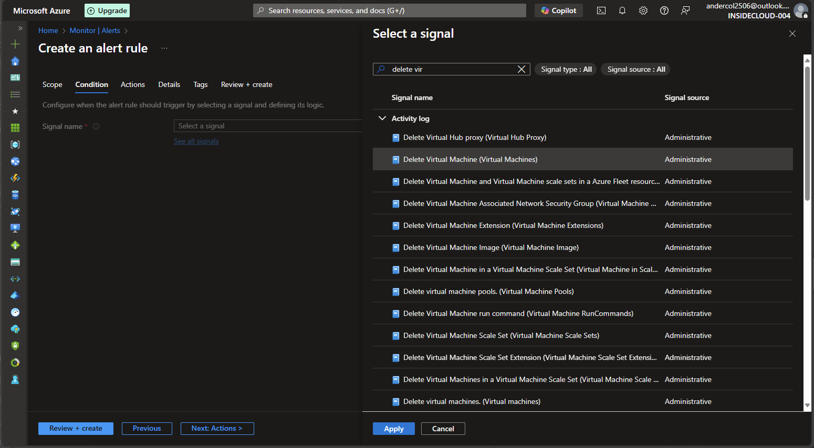
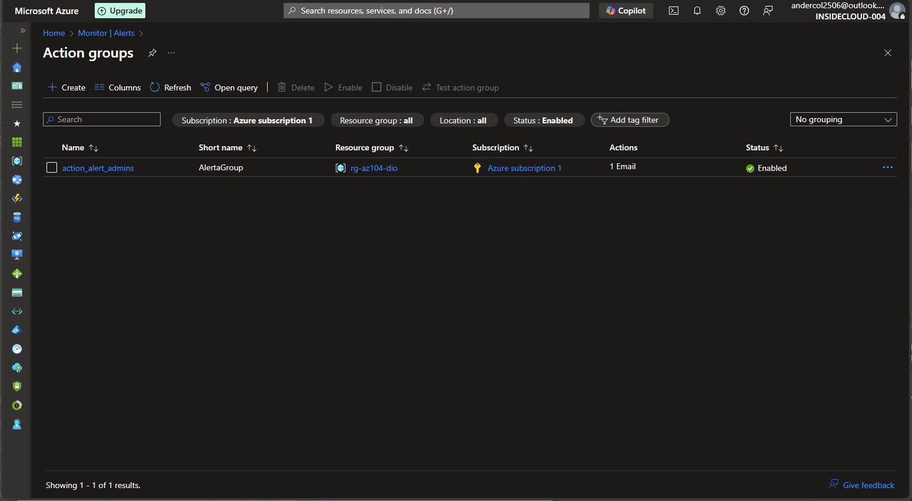

# Descrição do Desafio
Neste laboratório prático, você irá aprender a configurar e gerenciar o monitoramento de recursos no Microsoft Azure, com foco em máquinas virtuais (VMs). O objetivo é demonstrar como manter visibilidade, controle e resposta proativa sobre eventos críticos no ambiente de nuvem, como a exclusão de uma VM. Como entregável, o desafio proposto é a criação de um repositório contendo resumos, anotações e dicas sobre o uso da Azure, servindo como material de apoio para estudos e futuras implementações.

## Objetivos de Aprendizagem 

- Aplicar os conceitos aprendidos em um ambiente prático;
- Documentar processos técnicos de forma clara e estruturada; 
- Utilizar o GitHub como ferramenta para compartilhamento de documentação técnica. 

### Diagrama da solução implementada

### Etapas da implementação;

- Configurar um Resource Group (rg-az104-dio).
- Configurar a VNet (vnet-az104-dio).
- Configurar Subnet(sunet-dio01).
- Configurar NSG (nsg-az104-dio).
- Configurar regra de acesso RDP.   
- Associar o NSG a Subnet.
- Configurar a VM (vm-az104dio-001).
- Habilitar o monitoramento da VM.
- Configurar o Alert Rule.
- Configurar Action.
- Excluir a VM.
- Confirmar Alerta.
- Confirmar alerta e e-mail.

-----------------------

**Resource Group Configurado:**

**VNet e Subnet Configurada**

**NSG Configurado**

**VM Configurada:**

**Habilitando o Monitoramento**

**Configurar o Alert Rule**

**Configurar Action**

**Excluir a VM**

**Confirmar Alerta**

**Confirmar alerta e e-mail**

